# Benchmarking FreeFlow

[TOC]

## FreeFlow internals

FreeFlow 包括前端 FFL 和后端 FFR。前端 FFL 负责截取 Verbs 请求并转发给后端 FFR，FFR负责转发和加速 Verbs 并将结果返回给 FFL。FFL 是在 libibverbs (v1.2.1)、libmlx4 (v1.2.1) 和 librdmacm (v1.1.0) 之上修改而来，而 FFR 则无其它依赖。其中，libibverbs 和 librdmacm 允许用户态程序使用 InfiniBand/RDMA Verbs 和 RDMA CM 接口，而 libmlx4 向 libibverbs 提供 Mellanox 硬件访问服务。

### FFL

Verbs 相关变量和函数定义可以参见 include/infiniband/verbs.h。FFL 通过重写函数来截取 Verbs，即在 Verbs 函数的关键路径上调用自定义的 API，该 API 通过 Unix Socket 或者 SHMEM 和 FFR 交互以实现对应的行为。相关源码如下：

- libibverbs
  - libraries/libibverbs-1.2.1mlnx1/src/cmd.c
  - libraries/libibverbs-1.2.1mlnx1/src/cmd_exp.c
  - libraries/libibverbs-1.2.1mlnx1/src/verbs.c
  - libraries/libibverbs-1.2.1mlnx1/src/freeflow.c，主要实现和 FFR 的交互逻辑
- librdmacm
  - libraries/librdmacm-1.1.0mlnx/src/cma.c
- libmlx4
  - libraries/libmlx4-1.2.1mlnx1/src/freeflow.c
  - libraries/libmlx4-1.2.1mlnx1/src/verbs.c
  - libraries/libmlx4-1.2.1mlnx1/src/qp.c
  - libraries/libmlx4-1.2.1mlnx1/src/mlx4.c
  - libraries/libmlx4-1.2.1mlnx1/src/verbs_exp.c
  - libraries/libmlx4-1.2.1mlnx1/src/cq.c
  - libraries/libmlx4-1.2.1mlnx1/src/srq.c

### FFR

TODO：为什么 FFR 需要修改 librdmacm？

### IPC between FFL and FFR

容器环境下，FFL 和 FFR 之间的通信本质上为进程间的通信。目前，FFL 和 FFR 使支持两种 IPC，Unix Socket 和基于 SHMEM 和 polling 的 fastpath 模式。 当 fastpath 模式开启时，FFL 和 FFR 之间会预先共享一块内存（/dev/shm/*），然后 FFR 会创建一个 polling 线程（该线程会绑定到特定的 CPU core）来轮询该内存区域以发现 FFL 是否有新请求，有则处理，完了构造 response 并写入到指定内存区域。所以，FFL 只需要将 request 写入到共享内存中，然后进入忙等模式以及时收到 response。Fastpath 的过程如下图：

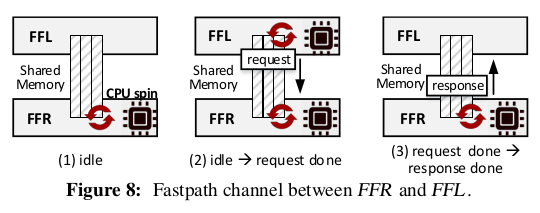

目前，使用 fastpath 模式的 API 如下：

- ibv_poll_cq
- ibv_post_send
- ibv_post_recv
- ibv_post_srq_recv

其它则使用 Unix Socket 进行通信。

### Types of shared memory between FFL and FFR

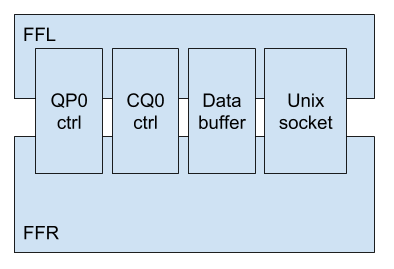

```bash
$ ls -1 /dev/shm/ 
client-10-memsize-8192-index-11
client-10-memsize-8192-index-4
client-10-memsize-8192-index-9
ctrlshm-cq2
ctrlshm-cq3
ctrlshm-cq4
ctrlshm-cq5
ctrlshm-qp1
```

### ibv_reg_mr @ibv_cmd_reg_mr

```c
// @Verbs API
/**
 * ibv_reg_mr - Register a memory region
 */
struct ibv_mr *ibv_reg_mr(struct ibv_pd *pd, void *addr,
			  size_t length, int access);

// @FFL CMD API
int ibv_cmd_reg_mr(struct ibv_pd *pd, void *addr, size_t length,
		   uint64_t hca_va, int access, struct ibv_mr *mr,
		   struct ibv_reg_mr *cmd, size_t cmd_size,
		   struct ibv_reg_mr_resp *resp, size_t resp_size)
{
	int ret;
	/* char key[64]; */
	struct mr_shm *p;

	if (PRINT_LOG) {
		printf("#### ibv_cmd_reg_mr ####\n");
		fflush(stdout);
	}

	// struct ibv_context {
	//	struct ibv_device	*device;
	//	struct ibv_context_ops	ops;
	//	int			cmd_fd;
	//	int			async_fd;
	//	int			num_comp_vectors;
	//	pthread_mutex_t		mutex;
	//	void			*abi_compat;
	// };
	//
	// struct ibv_pd {
	//	struct ibv_context *context;
	//	uint32_t handle;
	// };
	//
	// struct IBV_REG_MR_REQ {
	//	uint32_t pd_handle;
	//	uint32_t mem_size;
	//	uint32_t access_flags;
	//	char shm_name[100];
	// };
	struct IBV_REG_MR_REQ req_body;
	req_body.pd_handle = pd->handle;
	req_body.mem_size = length;
	req_body.access_flags = access;
	req_body.shm_name[0] = '\0';

	// struct IBV_REG_MR_RSP {
	//	uint32_t handle;
	//	uint32_t lkey;
	//	uint32_t rkey;
	//	char shm_name[100];
	// };
	struct IBV_REG_MR_RSP rsp;
	int rsp_size;

	// struct ibv_mr {
	//	struct ibv_context	*context;
	//	struct ibv_pd		*pd;
	//	void			*addr;
	//	size_t			length;
	//	uint32_t		handle;
	//	uint32_t		lkey;
	//	uint32_t		rkey;
	//	// Added by FFL
	//	char shm_name[100];
	//	void *shm_ptr;
	//	int shm_fd;
	// }
	//
	// FFR will allocate a corrsponding shared memory in SHMEM named
	// 'client-$(id)-memsize-$(memsize)-index-$(index-of-sp-in-shm_pool[$id])'
	// where type of `shm_pool[$id]` is std::vector<ShmPiece *>. Then, register
	// the sp in corrsponding PD and return mr. In FFR, mapping between
	// FFL PD and FFR PD is maintained in ffr->pd_map and indexed by pd->handle.
	// Aftering registering corrsponding memory backed in SHMEM, FFR will
	// store sp and mr in ffr->shmr_map[mr->handle] and ffr->mr_map[mr->handle]
	// sperately. FFR also maintains mapping between mr->lkey and sp->ptr in
	// ffr->lkey_ptr.
	//
	// Glance at flow of FFR handler for FFL's IBV_REG_MR request:
	//	ShmPiece *sp = new ShmPiece(ss.str().c_str(), memsize);
	//	ffr->shm_pool[client_id].push_back(sp);
	//
	//	pd = ffr->pd_map[client_pd_handle];
	//	mr = ibv_reg_mr(pd, sp->ptr, sp->size, access_flags);
	//
	//	ffr->shmr_map[mr->handle] = sp;
	//	ffr->mr_map[mr->handle] = mr;
	//	ffr->lkey_ptr[mr->lkey] = sp->ptr;
	request_router(IBV_REG_MR, &req_body, &rsp, &rsp_size);

	mr->handle = rsp.handle;
	mr->lkey = rsp.lkey;
	mr->rkey = rsp.rkey;
	strcpy(mr->shm_name, rsp.shm_name);

	// FreeFlow: mounting shared memory from router.
	mr->shm_fd = shm_open(mr->shm_name, O_CREAT | O_RDWR, 0666);
	ret = ftruncate(mr->shm_fd, length);

	char *membuff = (char *)malloc(length);
	memcpy(membuff, addr, length);

	// Note on argument `addr` in mmap: If addr is NULL, then the kernel
	// chooses the address at which to create the mapping; this is the most
	// portable method of creating a new mapping. If addr is not NULL, the
	// the kernel takes it as a hint about where to place the mapping; on
	// Linux, the mapping will be created at a nearby page boundary. The
	// address of the new mapping is returned as the result of the call.
	int is_align = (long)addr % (4 * 1024) == 0 ? 1 : 0;
	// MAP_FIXED: Don't interpret addr as a hint: place the mapping at exactly
	// that address. addr must be page size aligned. If the memory region
	// specified by addr and len overlaps pages of existing mapping(s), the
	// the overlapped part of the existing mapping(s) will be discarded.
	if (is_align)
		mr->shm_ptr = mmap(addr, length, PROT_READ | PROT_WRITE,
				   MAP_SHARED | MAP_FIXED | MAP_LOCKED,
				   mr->shm_fd, 0);
	else
		mr->shm_ptr = mmap(0, length, PROT_READ | PROT_WRITE,
				   MAP_SHARED | MAP_LOCKED, mr->shm_fd, 0);

	if (mr->shm_ptr == MAP_FAILED || ret > 0) {
		printf("mmap failed in reg mr.\n");
		fflush(stdout);
	} else {
		memcpy(mr->shm_ptr, membuff, length);
		if (PRINT_LOG) {
			printf("mmap succeed in reg mr.\n");
		}

		// struct IBV_REG_MR_MAPPING_REG {
		//	uint32_t key;
		//	char	 *mr_ptr;
		//	char     *shm_ptr;
		// };
		struct IBV_REG_MR_MAPPING_REQ new_req_body;
		new_req_body.key = mr->lkey;
		new_req_body.mr_ptr = addr;
		new_req_body.shm_ptr = mr->shm_ptr;

		// struct IBV_REG_MR_MAPPING_RSP {
		//	int ret;
		// };
		struct IBV_REG_MR_MAPPING_RSP new_rsp;

		// FFR will broadcast this mapping to other routers. And msg to
		// boradcast is the `new_req_body` and `new_req_body.shm_ptr` will
		// be reintialized to VMA of sp in FFR's address space in FFR.
		//
		// Glance at the related code piece in FFR:
		//	struct IBV_REG_MR_MAPPING_REQ *p =
		//		(struct IBV_REG_MR_MAPPING_REQ *)req_body;
		//	p->shm_ptr = (char *)(ffr->lkey_ptr[p->key]);
		request_router(IBV_REG_MR_MAPPING, &new_req_body, &new_rsp,
			       &rsp_size);

		// Mapping between mr and corrsponding shm_ptr.
		p = (struct mr_shm *)mempool_insert(map_lkey_to_mrshm,
						    mr->lkey);
		p->mr = addr;
		p->shm_ptr = mr->shm_ptr;

		if (PRINT_LOG) {
			printf("@@@@@@@@ lkey=%u, addr=%lu, shm_prt=%lu\n",
			       mr->lkey, (uint64_t)addr,
			       (uint64_t)(mr->shm_ptr));
			fflush(stdout);
		}

		/*
		hashmap_put(map_lkey_to_shm_ptr, key, (void*)(mr->shm_ptr));
		fflush(stdout);
		*/
	}

	mr->addr = addr;
	mr->length = length;
	mr->context = pd->context;
	free(membuff);
	return 0;
}

// @FFR CMD handler
void HandleRequest(struct handlerArgs *args) {
    FreeFlowRouter *ffr = args->ffr;
    int client_sock = args->client_sock;
    
    // ...
    
    while (1) {
        // ...
        case IBV_REG_MR: {
            LOG_DEBUG("REG_MR");

            // req_body = malloc(sizeof(struct IBV_REG_MR_REQ));
            if (read(client_sock, req_body, sizeof(struct IBV_REG_MR_REQ)) <
                sizeof(struct IBV_REG_MR_REQ)) {
                LOG_ERROR("REG_MR: Failed to read request body.");
                goto kill;
            }

            // create a shm buffer
            LOG_TRACE("Create a shared memory piece for client "
                      << header.client_id << " with size "
                      << ((struct IBV_REG_MR_REQ *)req_body)->mem_size);
            if (((struct IBV_REG_MR_REQ *)req_body)->shm_name[0] == '\0') {
                LOG_TRACE("create shm from client id and count.");
                sp = ffr->addShmPiece(
                    header.client_id,
                    ((struct IBV_REG_MR_REQ *)req_body)->mem_size);
            } else {
                LOG_TRACE("create shm from name: "
                          << ((struct IBV_REG_MR_REQ *)req_body)->shm_name);
                sp = ffr->addShmPiece(
                    ((struct IBV_REG_MR_REQ *)req_body)->shm_name,
                    ((struct IBV_REG_MR_REQ *)req_body)->mem_size);
            }

            if (sp == NULL) {
                LOG_ERROR("Failed to the shared memory piece.");
                goto end;
            }

            LOG_TRACE("Looking for PD with pd_handle "
                      << ((struct IBV_REG_MR_REQ *)req_body)->pd_handle);
            // Use pd_map to map client PD and host PD.
            pd = ffr->pd_map[((struct IBV_REG_MR_REQ *)req_body)->pd_handle];
            if (pd == NULL) {
                LOG_ERROR("Failed to get pd with pd_handle "
                          << ((struct IBV_REG_MR_REQ *)req_body)->pd_handle);
                goto end;
            }

            LOG_DEBUG("Registering a MR ptr=" << sp->ptr
                                              << ", size=" << sp->size);
            // Actually registering corresponding memory backed by SHMEM.
            mr = ibv_reg_mr(pd, sp->ptr, sp->size,
                            ((struct IBV_REG_MR_REQ *)req_body)->access_flags);
            if (mr == NULL) {
                LOG_ERROR(
                    "Failed to regiester the MR. Current shared memory size: "
                    << sp->size);
                goto end;
            }

            if (mr->handle >= MAP_SIZE) {
                LOG_ERROR("[Warning] MR handle ("
                          << mr->handle
                          << ") is no less than MAX_QUEUE_MAP_SIZE.");
            } else {
                ffr->shmr_map[mr->handle] = sp;
                ffr->mr_map[mr->handle] = mr;
            }

            // rsp = malloc(sizeof(struct IBV_REG_MR_RSP));
            size = sizeof(struct IBV_REG_MR_RSP);
            ((struct IBV_REG_MR_RSP *)rsp)->handle = mr->handle;
            ((struct IBV_REG_MR_RSP *)rsp)->lkey = mr->lkey;
            ((struct IBV_REG_MR_RSP *)rsp)->rkey = mr->rkey;
            strcpy(((struct IBV_REG_MR_RSP *)rsp)->shm_name, sp->name.c_str());

            LOG_TRACE("mr->handle=" << mr->handle);
            LOG_TRACE("mr->lkey=" << mr->lkey);
            LOG_TRACE("mr->rkey=" << mr->rkey);
            LOG_TRACE("shm_name=" << sp->name.c_str());

            // store lkey to ptr mapping
            pthread_mutex_lock(&ffr->lkey_ptr_mtx);
            ffr->lkey_ptr[mr->lkey] = sp->ptr;
            pthread_mutex_unlock(&ffr->lkey_ptr_mtx);
        } break;

        case IBV_REG_MR_MAPPING: {
            LOG_DEBUG("REG_MR_MAPPING");
            // req_body = malloc(sizeof(struct IBV_REG_MR_MAPPING_REQ));
            if (read(client_sock, req_body,
                     sizeof(struct IBV_REG_MR_MAPPING_REQ)) <
                sizeof(struct IBV_REG_MR_MAPPING_REQ)) {
                LOG_ERROR("REG_MR_MAPPING: Failed to read request body.");
                goto kill;
            }

            struct IBV_REG_MR_MAPPING_REQ *p =
                (struct IBV_REG_MR_MAPPING_REQ *)req_body;

            // In FFL, req_body.shm_ptr is initialized by VMA of sp in FFL's
            // address space, so here we should update it by VMA of it in FFR's
            // address space.
            pthread_mutex_lock(&ffr->lkey_ptr_mtx);
            p->shm_ptr = (char *)(ffr->lkey_ptr[p->key]);
            pthread_mutex_unlock(&ffr->lkey_ptr_mtx);

            struct sockaddr_in si_other, si_self;
            struct sockaddr src_addr;
            socklen_t addrlen;
            char recv_buff[1400];
            ssize_t recv_buff_size;

            int s, i, slen = sizeof(si_other);

            srand(client_sock);

            for (int i = 0; i < HOST_NUM; i++) {

                if ((s = socket(AF_INET, SOCK_DGRAM, IPPROTO_UDP)) == -1) {
                    LOG_ERROR("Error in creating socket for UDP client");
                    return;
                }

                memset((char *)&si_other, 0, sizeof(si_other));
                si_other.sin_family = AF_INET;
                si_other.sin_port = htons(UDP_PORT);

                memset((char *)&si_self, 0, sizeof(si_self));
                si_self.sin_family = AF_INET;
                int self_p = 0; // 2000 + rand() % 40000;
                si_self.sin_port = htons(self_p);

                if (inet_aton("0.0.0.0", &si_self.sin_addr) == 0) {
                    LOG_ERROR("Error in creating socket for UDP client self.");
                    continue;
                }

                if (bind(s, (const struct sockaddr *)&si_self,
                         sizeof(si_self)) < 0) {
                    LOG_ERROR("Failed to bind UDP. errno=" << errno);
                    continue;
                }

                if (inet_aton(HOST_LIST[i], &si_other.sin_addr) == 0) {
                    LOG_ERROR("Error in creating socket for UDP client other.");
                    continue;
                }

                if (sendto(s, req_body, sizeof(struct IBV_REG_MR_MAPPING_REQ),
                           0, (const sockaddr *)&si_other, slen) == -1) {
                    LOG_DEBUG("Error in sending MR mapping to "
                              << HOST_LIST[i]);
                } else {
                    LOG_TRACE("Sent MR mapping to " << HOST_LIST[i]);
                }

                if ((recv_buff_size =
                         recvfrom(s, recv_buff, 1400, 0, (sockaddr *)&si_other,
                                  (socklen_t *)&slen)) == -1) {
                    LOG_ERROR("Error in receiving MR mapping ack"
                              << HOST_LIST[i]);
                } else {

                    char src_str[INET_ADDRSTRLEN];
                    inet_ntop(AF_INET, &si_other.sin_addr, src_str,
                              sizeof src_str);

                    int src_port = ntohs(si_other.sin_port);
                    LOG_INFO("## ACK from " << HOST_LIST[i] << "/" << src_str
                                            << ":" << src_port
                                            << "ack-rkey=" << recv_buff
                                            << " rkey= " << p->key);
                }

                close(s);
            }

            size = sizeof(struct IBV_REG_MR_MAPPING_RSP);
            ((struct IBV_REG_MR_MAPPING_RSP *)rsp)->ret = 0;
        } break;
        // ...
    }
}
```

### ibv_post_send @ibv_cmd_post_send

```c
// @Verbs API
/**
 * ibv_post_send - Post a list of work requests to a send queue.
 *
 * If IBV_SEND_INLINE flag is set, the data buffers can be reused
 * immediately after the call returns.
 */
static inline int ibv_post_send(struct ibv_qp *qp, 
                                struct ibv_send_wr *wr,
                                struct ibv_send_wr **bad_wr)
{
	return qp->context->ops.post_send(qp, wr, bad_wr);
}

// @FFL CMD API
int ibv_cmd_post_send(struct ibv_qp *ibqp, struct ibv_send_wr *wr,
		      struct ibv_send_wr **bad_wr)
{
	//struct timespec st, et, stt, ett;
	//int time_us;
	//clock_gettime(CLOCK_REALTIME, &st);
	//struct ibv_post_send_resp resp;
	struct ibv_send_wr *i;
	struct ibv_send_wr *n, *tmp = NULL;
	struct ibv_sge *s;
	uint32_t *ah, ah_count = 0;
	uint32_t wr_count = 0, sge_count = 0, ret_errno;
	int j;

	char *mr, *shm, *addr;
	struct mr_shm *p;

	// CtrlShmPiece corresponds to QP one by one.
	//
	// #define CTRL_REQ_SIZE 1024 * 1024 // 1MB
	// struct CtrlShmPiece {
	//	volatile enum CtrlChannelState state;
	//	uint8_t req[CTRL_REQ_SIZE];
	//	uint8_t rsp[CTRL_RSP_SIZE];
	// };
	//
	// Format of req and rsp subjects to tuple(header, payload). There are
	// two types of headers including FfrRequestHeader and FfrResponseHeader.
	struct CtrlShmPiece *csp = qp_shm_map[ibqp->handle];
	pthread_mutex_t *csp_mtx = &(qp_shm_mtx_map[ibqp->handle]);

	// Here is the structure to store metadata, meanwhile data is passed by SHMEM.
	// req@csp := (FfrRequestHeader, struct ibv_post_send,
	//		[struct ibv_send_wr] * wr_count, [struct ibv_sge] * sge_count, ah)
	// e.g. req@csp = (header, cmd, [swr], [sge], ah)
	//
	// struct FfrRequestHeader {
	//	int client_id;
	//	RDMA_FUNCTION_CALL func;
	//	uint32_t body_size;
	// };
	//
	// struct ibv_post_send {
	//	__u32	command;
	//	__u16	in_words;
	//	__u16	out_words;
	//	__u64	response;
	//	__u32	qp_handle;
	//	__u32	wr_count;
	//	__u32	sge_count;
	//	__u32	sqe_size;
	//	struct	ibv_kern_send_wr send_wr[0];
	// };
	struct FfrRequestHeader *header = (struct FfrRequestHeader *)(csp->req);
	struct ibv_post_send *cmd =
		(struct ibv_post_send *)(csp->req +
					 sizeof(struct FfrRequestHeader));
	// rsp@csp := (FfrResponseHeader, struct IBV_POST_SEND_RSP)
	// e.g. rsp@csp = (header, rsp)
	//
	// struct FFrResponseHeader {
	//	int rsp_size;
	// };
	//
	// struct IBV_POST_SEND_RSP {
	//	int ret_errno;
	//	uint32_t bad_wr;
	// };
	struct IBV_POST_SEND_RSP *rsp =
		(struct IBV_POST_SEND_RSP *)(csp->rsp +
					     sizeof(struct FfrResponseHeader));

	if (PRINT_LOG) {
		printf("#### ibv_cmd_post_send ####\n");
		fflush(stdout);
	}

	for (i = wr; i; i = i->next) {
		wr_count++;
		sge_count += i->num_sge;
	}

	if (ibqp->qp_type == IBV_QPT_UD) {
		ah_count = wr_count;
	}

	// Entering critical section
	pthread_mutex_lock(csp_mtx);

	header->client_id = ffr_client_id;
	header->func = IBV_POST_SEND;
	header->body_size = sizeof *cmd + wr_count * sizeof *n +
			    sge_count * sizeof *s + ah_count * sizeof(uint32_t);

	// IBV_INIT_CMD_RESP(cmd, req_body.wr_size, POST_SEND, &resp, sizeof resp);
	cmd->qp_handle = ibqp->handle;
	cmd->wr_count = wr_count;
	cmd->sge_count = sge_count;

	n = (struct ibv_send_wr *)((void *)cmd + sizeof *cmd);
	s = (struct ibv_sge *)(n + wr_count);
	ah = (uint32_t *)(s + sge_count);

	tmp = n;
	for (i = wr; i; i = i->next) {
		memcpy(tmp, i, sizeof(struct ibv_send_wr));
		if (ibqp->qp_type == IBV_QPT_UD) {
			*ah = i->wr.ud.ah->handle;
			ah = ah + 1;
		}

		if (tmp->num_sge) {
			/* freeflow copy data */
			memcpy(s, i->sg_list, tmp->num_sge * sizeof *s);
			// Need to copy data from FFL buffer into buffer managed
			// by FFR segment by segment.
			for (j = 0; j < tmp->num_sge; j++) {
				//clock_gettime(CLOCK_REALTIME, &stt);
				p = (struct mr_shm *)mempool_get(
					map_lkey_to_mrshm, s[j].lkey);
				//clock_gettime(CLOCK_REALTIME, &ett);
				//time_us = (ett.tv_sec - stt.tv_sec) * 1000000 +
				//(ett.tv_nsec - stt.tv_nsec) / 1000;
				//if (time_us >= 5)
				//printf("mempool_get --> %d\n", time_us);
				//fflush(stdout);

				// Map lkey to MR and SHM pointer
				// struct mr_shm {
				//	char *mr;
				//	char *shm_ptr;
				// };
				mr = p->mr;
				shm = p->shm_ptr;

				// struct ibv_sge {
				//	uint64_t	addr;
				//	uint32_t	length;
				//	uint32_t	lkey;
				// };
				addr = (char *)(s[j].addr);
				if (shm + (addr - mr) != addr) {
					memcpy(shm + (addr - mr), addr,
					       s[j].length);
				}

				// When current sge fired, s[j].addr will be
				// assigned with VA of the buffer in FFR's
				// address space.
				//
				// @ffrouter.cpp: case IBV_POST_SEND:
				//	sge[j].addr = (uint64_t)(
				//		(char *)(ffr->lkey_ptr[sge[j].lkey]) +
				//		sge[j].addr);
				s[j].addr = addr - mr;

				if (PRINT_LOG) {
					printf("!!!!!!!!!! length=%u,addr=%lu,lkey=%u,
                           mr_ptr=%lu,shm_ptr=%lu,original_addr=%lu\n",
					       s[j].length, s[j].addr,
					       s[j].lkey, (uint64_t)mr,
					       (uint64_t)shm, (uint64_t)addr);
					fflush(stdout);
					printf("wr=%lu, sge=%lu, sizeof send_wr=%lu\n",
					       (uint64_t)n, (uint64_t)s,
					       sizeof(*n));
					fflush(stdout);
				}
			}

			s += tmp->num_sge;
		}

		tmp++;
	}

	uint8_t disable_fastpath = 0;
	if (!getenv("DISABLE_FASTPATH")) {
		disable_fastpath = 0;
	} else {
		disable_fastpath = atoi(getenv("DISABLE_FASTPATH"));
	}

	// struct IBV_POST_SEND_REQ {
	//	uint32_t wr_size;
	//	char *wr;
	// };
	if (disable_fastpath) {
		struct IBV_POST_SEND_REQ req_body;
		req_body.wr_size = header->body_size;
		// `cmd` stays on csp. And FFR maintains a mapping between FFL's QP
		// and FFR's QP. So that FFR can get real QP in the following
		// style:
		//	qp = ffr->qp_map[post_send->qp_handle]
		// where pointer `post_send` refers to data pointed by `cmd`.
		req_body.wr = cmd;
		int rsp_size;
		// It will deliver the req_body with new FfrRequestHeader ahead.
		request_router(IBV_POST_SEND, &req_body, rsp, &rsp_size);
	} else
		request_router_shm(csp);

	wr_count = rsp->bad_wr;
	if (wr_count) {
		i = wr;
		while (--wr_count)
			i = i->next;
		*bad_wr = i;
	} else if (rsp->ret_errno) {
		*bad_wr = wr;
	}

	ret_errno = rsp->ret_errno;
	wmb();
	csp->state = IDLE;
	pthread_mutex_unlock(csp_mtx);

	//clock_gettime(CLOCK_REALTIME, &et);
	//    time_us = (et.tv_sec - st.tv_sec) * 1000000 +
	//                        (et.tv_nsec - st.tv_nsec) / 1000;

	//if (PRINT_LOG)
	//if (time_us >= 5)
	//{
	//	printf("--------------> post_send_delay = %d us, 
    //			wr_count = %d, sge_count = %d\n", time_us, wr_count, sge_count);
	//	fflush(stdout);
	//}

	return ret_errno;
}

// @FFR CMD handler
void HandleRequest(struct HandlerArgs *args) {
    FreeFlowRouter *ffr = args->ffr;
    int client_sock = args->client_sock;
    
    // ...
    while (1) {
        case IBV_POST_SEND: {
            LOG_INFO("POST_SEND");
            // req_body = malloc(header.body_size);
            if (read(client_sock, req_body, header.body_size) <
                header.body_size) {
                LOG_ERROR("POST_SEND: Error in reading in post send.");
                goto end;
            }

            // Now recover the qp and wr
            struct ibv_post_send *post_send = (struct ibv_post_send *)req_body;
            if (post_send->qp_handle >= MAP_SIZE) {
                LOG_ERROR("[Warning] QP handle ("
                          << post_send->qp_handle
                          << ") is no less than MAX_QUEUE_MAP_SIZE.");
            } else {
                qp = ffr->qp_map[post_send->qp_handle];
                tb = ffr->tokenbucket[post_send->qp_handle];
            }

            // Attributes of wr can be learned from flattered structure stored
            // in shared memory.
            struct ibv_send_wr *wr =
                (struct ibv_send_wr *)((char *)req_body +
                                       sizeof(struct ibv_post_send));
            struct ibv_sge *sge =
                (struct ibv_sge *)((char *)req_body +
                                   sizeof(struct ibv_post_send) +
                                   post_send->wr_count *
                                       sizeof(struct ibv_send_wr));

            uint32_t *ah = NULL;
            if (qp->qp_type == IBV_QPT_UD) {
                LOG_INFO("POST_SEND_UD!!!");
                ah = (uint32_t *)(sge + post_send->sge_count);
            }

            uint32_t wr_success = 0;
            for (int i = 0; i < post_send->wr_count; i++) {
                LOG_INFO("wr[i].wr_id=" << wr[i].wr_id
                                        << " opcode=" << wr[i].opcode
                                        << " imm_data==" << wr[i].imm_data);

                if (wr[i].opcode == IBV_WR_RDMA_WRITE ||
                    wr[i].opcode == IBV_WR_RDMA_WRITE_WITH_IMM ||
                    wr[i].opcode == IBV_WR_RDMA_READ) {
                    if (ffr->rkey_mr_shm.find(wr[i].wr.rdma.rkey) ==
                        ffr->rkey_mr_shm.end()) {
                        LOG_ERROR("One sided opertaion: can't find remote MR. "
                                  "rkey --> "
                                  << wr[i].wr.rdma.rkey << "  addr --> "
                                  << wr[i].wr.rdma.remote_addr);
                    } else {
                        LOG_DEBUG(
                            "shm:"
                            << (uint64_t)(
                                   ffr->rkey_mr_shm[wr[i].wr.rdma.rkey].shm_ptr)
                            << " app:" << (uint64_t)(wr[i].wr.rdma.remote_addr)
                            << " mr:"
                            << (uint64_t)(ffr->rkey_mr_shm[wr[i].wr.rdma.rkey]
                                              .mr_ptr));
                        wr[i].wr.rdma.remote_addr =
                            (uint64_t)(
                                ffr->rkey_mr_shm[wr[i].wr.rdma.rkey].shm_ptr) +
                            (uint64_t)wr[i].wr.rdma.remote_addr -
                            (uint64_t)ffr->rkey_mr_shm[wr[i].wr.rdma.rkey]
                                .mr_ptr;
                    }
                }

                // fix the link list pointer
                if (i >= post_send->wr_count - 1) {
                    wr[i].next = NULL;
                } else {
                    wr[i].next = &(wr[i + 1]);
                }
                if (wr[i].num_sge > 0) {
                    // fix the sg list pointer
                    wr[i].sg_list = sge;
                    pthread_mutex_lock(&ffr->lkey_ptr_mtx);
                    for (int j = 0; j < wr[i].num_sge; j++) {
                        while (!(tb->consume(sge[j].length))) {
                            uint32_t stime =
                                sge[j].length * 1000000 / MAX_QP_RATE_LIMIT;
                            if (stime) {
                                usleep(stime);
                            } else {
                                usleep(1);
                            }
                            // wr[i-1].next = NULL;
                            // break;
                        }
                        LOG_DEBUG("wr[i].wr_id="
                                  << wr[i].wr_id << " qp_num=" << qp->qp_num
                                  << " sge.addr=" << sge[j].addr
                                  << " sge.length" << sge[j].length
                                  << " opcode=" << wr[i].opcode);
                        sge[j].addr = (uint64_t)(
                            (char *)(ffr->lkey_ptr[sge[j].lkey]) + sge[j].addr);
                        LOG_DEBUG("data=" << ((char *)(sge[j].addr))[0]
                                          << ((char *)(sge[j].addr))[1]
                                          << ((char *)(sge[j].addr))[2]);
                        LOG_DEBUG("imm_data==" << wr[i].imm_data);
                    }
                    pthread_mutex_unlock(&ffr->lkey_ptr_mtx);

                    sge += wr[i].num_sge;
                }

                else {
                    wr[i].sg_list = NULL;
                }

                // fix ah
                if (qp->qp_type == IBV_QPT_UD) {
                    wr[i].wr.ud.ah = ffr->ah_map[*ah];
                    ah = ah + 1;
                }

                wr_success++;
            }

            struct ibv_send_wr *bad_wr = NULL;
            // rsp = malloc(sizeof(struct IBV_POST_SEND_RSP));
            size = sizeof(struct IBV_POST_SEND_RSP);

            ((struct IBV_POST_SEND_RSP *)rsp)->ret_errno =
                ibv_post_send(qp, wr, &bad_wr);
            if (((struct IBV_POST_SEND_RSP *)rsp)->ret_errno != 0) {
                LOG_ERROR("[Error] Post send (" << qp->handle << ") fails.");
            }

            LOG_DEBUG("post_send success.");

            if (bad_wr == NULL) {
                // this IF is not needed right now, but left here for future use
                if (post_send->wr_count == wr_success) {
                    ((struct IBV_POST_SEND_RSP *)rsp)->bad_wr = 0;
                } else {
                    ((struct IBV_POST_SEND_RSP *)rsp)->bad_wr =
                        post_send->wr_count - wr_success;
                    ((struct IBV_POST_SEND_RSP *)rsp)->ret_errno = ENOMEM;
                }
            } else {
                LOG_ERROR("bad_wr is not NULL.");
                ((struct IBV_POST_SEND_RSP *)rsp)->bad_wr = bad_wr - wr;
            }
        } break;
    }
    // ...
}

// @FFR CMD handler in fast path
void CtrlChannelLoop(struct HandlerArgs *args) {
    FreeFlowRouter *ffr = args->ffr;
    cpu_set_t cpuset;
    
    int cpu = 2;
    CPU_ZERO(&cpuset);
    CPU_SET(cpu, &cpuset);
    /*
     * cpu affinity for the calling thread
     * first parameter is the pid, 0 = calling thread
     * second parameter is the size of your cpuset
     * third param is the cpuset in which your thread will be
     * placed. Each bit represents a CPU
     */
    sched_setaffinity(0, sizeof(cpuset), &cpuset);
    
    // ...
    
    while (1) {
        pthread_mutex_lock(&ffr->qp_shm_vec_mtx);
        for (int i = 0; i < ffr->qp_shm_vec.size(); i++) {
            qp_sp = ffr->qp_shm_map[ffr->qp_shm_vec[i]];
            
            if (qp_sp) {
                qp_csp = (struct CtrlShmPiece *)qp_sp->ptr;
                if (qp_csp->state = REQ_DONE) {
                    req_header = (struct FfrRequestHeader *)qp_csp->req;
                    req_body = qp_csp->req +  sizeof(struct FfrRequestHandler);
                    rsp_header = (struct FfrResponseHeader *)qp_csp->rsp;
                    rsp = qp_csp->rsp + sizeof(struct FfrResponseHeader);
                    switch (req_header->func) {
                    case IBV_POST_SEND: {
                        // Now recover the qp and wr
                        struct ibv_post_send *post_send =
                            (struct ibv_post_send *)req_body;
                        if (post_send->qp_handle >= MAP_SIZE) {
                            LOG_ERROR(
                                "[Warning] QP handle ("
                                << post_send->qp_handle
                                << ") is no less than MAX_QUEUE_MAP_SIZE.");
                        } else {
                            qp = ffr->qp_map[post_send->qp_handle];
                            tb = ffr->tokenbucket[post_send->qp_handle];
                        }

                        struct ibv_send_wr *wr =
                            (struct ibv_send_wr *)((char *)req_body +
                                                   sizeof(
                                                       struct ibv_post_send));
                        struct ibv_sge *sge =
                            (struct ibv_sge *)((char *)req_body +
                                               sizeof(struct ibv_post_send) +
                                               post_send->wr_count *
                                                   sizeof(struct ibv_send_wr));

                        uint32_t *ah = NULL;
                        if (qp->qp_type == IBV_QPT_UD) {
                            // LOG_INFO("POST_SEND_UD!!!");
                            ah = (uint32_t *)(sge + post_send->sge_count);
                        }

                        uint32_t wr_success = 0;
                        int count = 0;
                        for (int i = 0; i < post_send->wr_count; i++) {

                            if (wr[i].opcode == IBV_WR_RDMA_WRITE ||
                                wr[i].opcode == IBV_WR_RDMA_WRITE_WITH_IMM ||
                                wr[i].opcode == IBV_WR_RDMA_READ) {

                                while (1) {
                                    pthread_mutex_lock(&ffr->rkey_mr_shm_mtx);
                                    if (ffr->rkey_mr_shm.find(
                                            wr[i].wr.rdma.rkey) ==
                                        ffr->rkey_mr_shm.end()) {
                                        if (count > 4) {
                                            LOG_ERROR(
                                                "One sided opertaion: can't "
                                                "find remote MR. rkey --> "
                                                << wr[i].wr.rdma.rkey
                                                << "  addr --> "
                                                << wr[i].wr.rdma.remote_addr);
                                            pthread_mutex_unlock(
                                                &ffr->rkey_mr_shm_mtx);
                                            break;
                                        }
                                    } else {
                                        wr[i].wr.rdma.remote_addr =
                                            (uint64_t)(ffr->rkey_mr_shm
                                                           [wr[i].wr.rdma.rkey]
                                                               .shm_ptr) +
                                            (uint64_t)wr[i]
                                                .wr.rdma.remote_addr -
                                            (uint64_t)ffr
                                                ->rkey_mr_shm[wr[i]
                                                                  .wr.rdma.rkey]
                                                .mr_ptr;
                                        pthread_mutex_unlock(
                                            &ffr->rkey_mr_shm_mtx);
                                        break;
                                    }

                                    pthread_mutex_unlock(&ffr->rkey_mr_shm_mtx);
                                    sleep(0.5);
                                    count++;
                                }
                            }

                            // fix the link list pointer
                            if (i >= post_send->wr_count - 1) {
                                wr[i].next = NULL;
                            } else {
                                wr[i].next = &(wr[i + 1]);
                            }
                            if (wr[i].num_sge > 0) {
                                // fix the sg list pointer
                                wr[i].sg_list = sge;
                                pthread_mutex_lock(&ffr->lkey_ptr_mtx);
                                for (int j = 0; j < wr[i].num_sge; j++) {
                                    sge[j].addr = (uint64_t)(
                                        (char *)(ffr->lkey_ptr[sge[j].lkey]) +
                                        sge[j].addr);
                                }
                                pthread_mutex_unlock(&ffr->lkey_ptr_mtx);

                                sge += wr[i].num_sge;
                            } else {
                                wr[i].sg_list = NULL;
                            }

                            // fix ah
                            if (qp->qp_type == IBV_QPT_UD) {
                                wr[i].wr.ud.ah = ffr->ah_map[*ah];
                            }

                            wr_success++;
                        }

                        struct ibv_send_wr *bad_wr = NULL;
                        // rsp = malloc(sizeof(struct IBV_POST_SEND_RSP));
                        rsp_header->rsp_size = sizeof(struct IBV_POST_SEND_RSP);

                        ((struct IBV_POST_SEND_RSP *)rsp)->ret_errno =
                            ibv_post_send(qp, wr, &bad_wr);
                        if (((struct IBV_POST_SEND_RSP *)rsp)->ret_errno != 0) {
                            LOG_ERROR("[Error] Post send (" << qp->handle
                                                            << ") fails.");
                        }

                        // LOG_DEBUG("post_send success.");

                        if (bad_wr == NULL) {
                            // this IF is not needed right now, but left here
                            // for future use
                            if (post_send->wr_count == wr_success) {
                                ((struct IBV_POST_SEND_RSP *)rsp)->bad_wr = 0;
                            } else {
                                ((struct IBV_POST_SEND_RSP *)rsp)->bad_wr =
                                    post_send->wr_count - wr_success;
                                ((struct IBV_POST_SEND_RSP *)rsp)->ret_errno =
                                    ENOMEM;
                            }
                        } else {
                            LOG_ERROR("bad_wr is not NULL.");
                            ((struct IBV_POST_SEND_RSP *)rsp)->bad_wr =
                                bad_wr - wr;
                        }
                    } break;
                    
                    default:
                    	break; 
                    }
                    
                    wmb();
                    qp_csp->state = RSP_DONE;
                }
            }
        }
        pthread_mutex_unlock(&ffr->qp_shm_vec_mtx);
        
        // CQ operations
        pthread_mutex_lock(&ffr->cq_shm_vec_mtx);
        for (int i = 0; i < ffr->cq_shm_vec.size(); i++) {
            // ...
        }
        pthread_mutex_unlock(&ffr->cq_shm_vec_mtx);
        
        // SRQ operations.
        pthread_mutex_lock(&ffr->srq_shm_vec_mtx);
        for (int i = 0; i < ffr->frq_shm_vec.size(); i++) {
            // ...
        }
        pthread_mutex_unlock(&ffr->seq_shm_vec_mtx);
        
        if (ffr->rdma_polling_interval > 0) {
            usleep(ffr->rdma_polling_internval).
        }
    }
}
```

### ibv_post_recv @ibv_cmd_post_recv

Same as `ibv_post_send`.

### ibv_poll_cq @ibv_cmd_poll_cq

TODO

## rsocket internals 

TODO

## VMA internals

TODO

## Micro-benchmarks	

测试服务器配置：

- OS 为 Ubuntu 14.04.5 LTS
- Mellanox ConnectX-3 Adapter，驱动为 MLNX_OFED_LINUX-4.0-2.0.0.1-ubuntu14.04-x86_64
- Intel(R) Xeon(R) CPU E5-2650 v3 @ 2.30GHz
- 64 GB DRAM @ 2133 MHz
- Docker version 18.06.1-ce, build e68fc7a
- Weave verion 2.5.0
- FreeFlow setup refers to https://github.com/rhiswell/Freeflow

### 测试项目和工具

考虑三种场景：

- Host Verbs，即在主机 OS 上测试 Verbs 和 Socket-to-Verbs 转换库的性能；
- FreeFlow Verbs，即在容器中测试 FreeFlow 提供的 Verbs 服务的性能，默认前后端使用 SHMEM 和 polling 模式进行通信。该模式下，后端会多占用一个 CPU core 用于论询 SHMEM 中的状态，同时前端需要周期性论询 SHMEM 以查看任务完成情况；
- FreeFlow Verbs with low CPU。相比 FreeFlow Verbs，该模式下前后端使用 Unix Socket 和 event-driven 方式进行通信，无需占用 CPU core。

基础测试包括 RDMA  Verbs 性能和 socket-to-Verbs 转换库性能两个层面的测试。Verbs 性能测试指标包括延迟和吞吐率，单边和双边通信分别选择 write 和 send 作为测试对象。Socket-to-Verbs 转换库性能指标包括延迟和吞吐率。具体测试项目和对应的工具罗列如下：

- [x] RDMA SEND Tput & Latency (HOST / FF / FF_lowCPU)
  - [x] ib_send_lat -H
  - [x] ib_send_bw -a
- [x] RDMA WRITE Tput & Latency (HOST / FF / FF_lowCPU)
  - [x] ib_write_lat -H
  - [x] ib_write_bw -a
  - [x] ib_read_lat -H
  - [x] ib_read_bw -a
- [x] TCP Tput & Latency (HOST/ FF / ~~FF_lowCPU~~ since iperf3 cannot run over FF when disabling fastpath and error looks like `[ERROR] One sided opertaion: can't find remote MR. rkey --> 3033393256  addr --> 139649563697232` )
  - [x] `iperf3 -J -i 0 -w $((2**$((seq 1 23))))`
  - [x] NPtcp
  - [x] ~~sockperf~~ since it cannot run over rsocket. 

### Verbs send/write 性能结果

测试指标包括延迟和吞吐率。

下图测得不同场景下 Verbs 吞吐率随着包大小（2B ～ 8MB）的变化情况。观察得两个现象：

1. Verbs 中，send 和 write 吞吐率变化没什么差别；
2. Host Verbs 和 FreeFlow Verbs 最后都能趋于 37.5 Gbps，但 FreeFlow Verbs 中该变化趋势推后。目前，我还不怎么明白这种变化趋势推后的原因。同时还有一个问题，ConnectX-3 默认模式为 IB，对应的硬件带宽为 56 Gbps，而 Verbs 峰值为什么只有 37.5 Gbps？

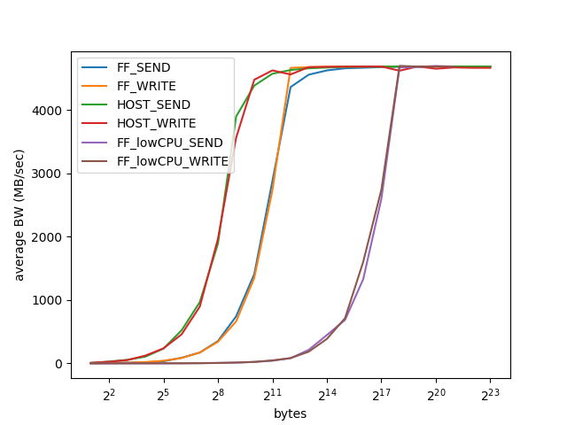

下图测得通信延迟（RTT / 2）的 CDF。因为 FreeFlow  Verbs with low CPU 性能较差，所以先不包括它。观察得几个现象：

1. Verbs 中，send 比 write 延迟要高一些；
2. Host Verbs 单边平均延迟为 0.7us，双边平均延迟为 0.78us，且均无严重尾延迟；
3. 相关 Host Verbs，FreeFlow Verbs 延迟增加一倍，单边平均延迟为 1.3us，双边平均延迟为 1.9us，且双边通信有较高的尾延迟（P99 为 3.7us，P99.9 为 10.3us）。

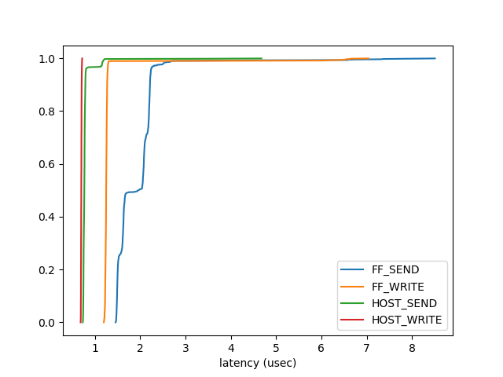

下图中加入了 FreeFlow Verbs with low CPU 的延迟，可以看到其性能很差，平均延迟比 FreeFlow 论文中慢 3 倍，现在还没有排除实验环境的影响，应该可以进一步提高。各种模式下 Verbs send/write 的延迟见下表：

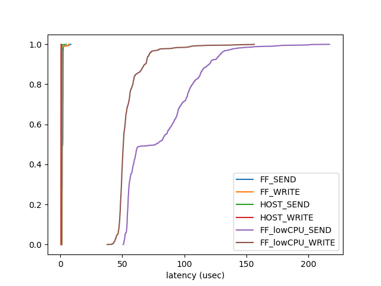

| type            | \#bytes | \#iterations | \#t_avg (us) | \#t_typical (us) | \#t_P99 (us) | \#t_P99.9 (us) |
| --------------- | ------- | ------------ | ------------ | ---------------- | ------------ | -------------- |
| HOST_write      | 2       | 1000         | 0.70         | 0.70             | 0.72         | 0.72           |
| HOST_send       | 2       | 1000         | 0.78         | 0.77             | 1.19         | 6.20           |
| FF_write        | 2       | 1000         | 1.30         | 1.25             | 6.06         | 7.32           |
| FF_send         | 2       | 1000         | 1.90         | 1.95             | 3.70         | 10.30          |
| FF_lowCPU_write | 2       | 1000         | 54.65        | 50.82            | 108.00       | 173.40         |
| FF_lowCPU_send  | 2       | 1000         | 81.05        | 76.77            | 172.84       | 219.52         |

### Socket-to-Verbs 转换库性能结果

目前，FreeFlow Verbs 上只能跑通 rsocket，故只测试 rsocket 转换库的性能。包括测试单条 TCP 流的吞吐率和延迟。

下图为单条 TCP 流的吞吐率随着包大小的变化情况。Rsocket over FreeFlow Verbs 和 rsocket over Verbs 最后都能达到 40 Gbps，但 rsocket over FreeFlow Verbs 变化有推后。

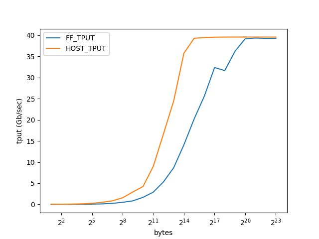

下图为 NPtcp 工具给出的通信延迟随着包大小的变化情况。其中，由于 FreeFlow BUG，绿线并不完整。下表给出各场景下传输 1 字节的通信延迟。**由目前的实验来看，相比 rsocket over Verbs，rsocket over FreeFlow verbs 性能不好，有改进空间，尤其是 rsocket over FreeFlow Verbs with low CPU，在延迟上有望提升 1 到 2 个量级。**

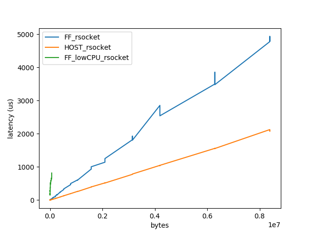

| type              | \#bytes | \#t_avg (us) |
| ----------------- | ------- | ------------ |
| HOST_rsocket      | 1       | 0.89         |
| FF_rsocket        | 1       | 5.35         |
| FF_lowCPU_rsocket | 1       | 164.11       |

### 分析

**Q0.** 相比于 Host Verbs，FreeFlow Verbs 增加了哪些开销？

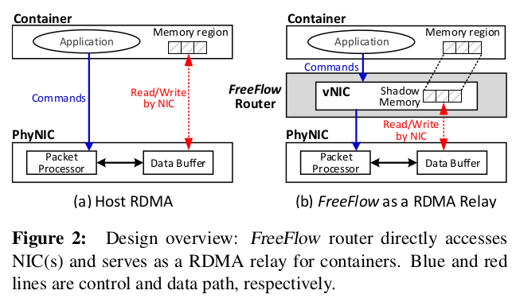

Host Verbs 包括控制路径和数据路径（见图 2a）。控制路径上主要涉及连接的建立、数据发送和数据接受状态的维护，而数据路径直接由 RNIC 管理（kernel bypass）。FreeFlow 作为应用和 RNIC 之间的桥阶层（见图 2b），需要分别转发控制路径和数据路径上的请求。数据路径上，FreeFlow 实现了零拷贝，无额外的开销。而在控制路径上，FreeFlow Verbs 需要先被 FFL 封装成请求信息并转递给 FFR，FFR 查表转发然后将结果返回给 FFL，所以对每一次 Verbs 操作，两次 IPC（一次 request 和一次 response）和一次查表操作是 FreeFlow Verbs 中引入的额外开销。

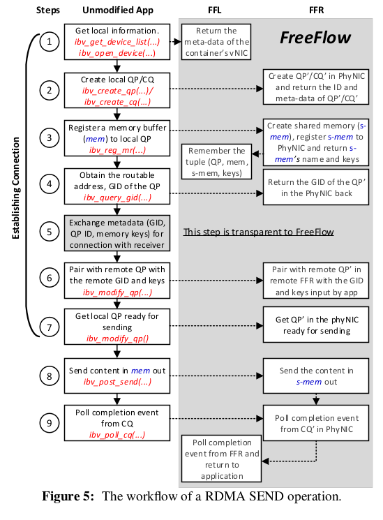

以 RDMA SEND 操作为例，图 5 是其运行流程。其中，步骤 1～7 用于建立连接，步骤 8、9 用于数据传输。连接建立过程中的主要开销来自于步骤 3，其它 API 的开销可忽略不急，因为步骤 3 中的 `ibv_reg_mr` 会在重映射 buffer 后广播更新所有 FFR 中相关的地址转换表项。当然，一般场景下，应用都是建立一次连接，反复执行步骤 8 和步骤 9 来发送和接受数据，所以步骤 8 和 9 成为主要的开销。这里我们进一步分析 ibv_post_send 和 ibv_poll_cq 内部的开销。

应用通过 `ibv_post_send` 向 RNIC 提交数据读写请求（SEND / READ / WRITE），通过 `ibv_poll_cq` 来查看请求是否完成。FreeFlow Verbs 中，`ibv_post_send` 流程如下：

1. 用户调用 `ibv_post_send` 以向指定的 QP 提交一个 work request (wr) 链表，每一个 wr 描述了一次 RDMA 操作的类型（SEND / REAED / WRITE）和涉及的本地和远程 buffer（若是 SEND，则只提供本地 buffer 地址，若是 READ / WRITE，则需要同时提供本地和远程 buffer 地址）；
2. FFL 将参数序列化做为请求的 payload，添加请求包头（FfrRequestHeader）后通过 fastpath 或者 Unix Socket 发送给 FFR；
3. FFR 收到请求后，反序列化参数（重点是查表将 buffer 的地址转换成为 FFR 所在进程的地址空间中的地址），然后调用主机中的 `ibv_post_send` ；
4. FFR 将函数返回值序列化并作为 payload，添加回应包头（ffrResponseHeader）后通过 fastpath 或者 Unix Socket 发送给 FFL；
5. FFL 收到回复后，反序列化参数并返回给应用。

其中，步骤 2～4 是 FreeFlow 引入的额外的控制流程，包括两次 IPC 和一次地址转换的查表操作。

综上，在分析 FreeFlow 引入的开销时，我们只需要关注以下四个 API ：ibv_poll_cq、ibv_post_send 、ibv_post_recv 和 ibv_post_srq_recv。FreeFlow 分别为其添加了 fastpath 模式来加快 IPC。然而，fastpath 模式下，FFR 的 polling 线程需要负责轮询所有的 QP、CQ 和 SRQ，随着连接的增加，polling 线程本身会成为瓶颈。

P.S. 若应用每次发送数据前都需要注册新 buffer，则 `ibv_reg_mr` 的开销将成为热点。因为每次注册 `ibv_reg_mr` 会在重映射 buffer 后广播更新所有 FFR 上相关的地址转换表项。

**Q1.** 相比主机 Verbs，FreeFlow Verbs 的吞吐率随着包长k的变化情况为什么会推后？

一般，throughput 定义如下：
$$
throughput = \frac{transfered\_bytes\_in\_total}{elapsed\_time\_in\_total}
$$
RDMA 传输模型中，数据的传输可以分为三段（设应用已经建立好连接，即创建好 PD、CQ 和 QP）：

1. 应用向 PD 中注册得用缓冲区，然后构造 work request (wr) 向 QP 提交该请求，最后 poll CQ 拿到对应的 work completion (wc) 以得到 wr 的处理结果（利用 wc.wr_id 和 wr 对应起来）；
2. RNIC 根据该 wr 进行数据传输，完了将 wc 写入到 CQ 中；
3. 应用从 CQ 中取出 wc 并处理，完了继续其它的任务。

其中，步骤 1 和 3 属于控制路径，步骤 2 属于数据路径，又数据路径上消耗的时间正比于传输字节的大小，然后公式可以进一步细化为：
$$
throughput = \frac{transfered\_bytes\_in\_total}{elapsed\_time\_in\_ctrlpath + \alpha \cdot transfered\_bytes\_in\_total}
$$
FreeFlow Verbs 中，数据路径上实现了 zero copy，无额外的开销，但控制路径上引入了额外的开销（两次 IPC 和一次查表）。根据上式，相比主机 Verbs，系统整体的 $throughput$ 会推后，同时 $latency$ 也会增加。

**Q2.** 相比主机 Verbs，FreeFlow Verbs 的延迟为什么更高？

我觉得应该有一个 cost breakdown 的分析，但是不知道怎么做。

延迟更高的原因如上，即 FreeFlow Verbs 在控制路径上引入了额外的开销导致的。其中，IPC 应该是瓶颈，当关闭 FreeFlow fastpath 模式时（DISABLE_FASTPATH=1），FreeFlow Verbs 的延迟将非常高。

这里给几张火焰图感受一下。考虑到 FreeFlow router 有两种方式处理来自前端的请求：

1. Low CPU mode：为每一个前端请求创建一个线程并处理；
2. Fastpath mode：ffrouter 启动时创建一个 polling 线程来论询前端请求。

默认情况下，ffrouter 开启 fastpath 模式，这时候 ffrouter 会占用一个 core 来跑 polling 线程，若在开启 ffrouter 的情况下获取 ib_send_lat 的火焰图，则会看到一个 router 线程。前两张火焰图为开启 ffrouter 前后主机 ib_send_lat 运行状态的对比。后两张火焰图为 ib_send_lat over FreeFlow Verbs 两种模式下的对比，前者为 fastpath 模式，后者为 low CPU 模式。

```bash
docker stop router1 && \
	perf record -F 99 -a --call-graph dwarf -- ib_send_lat -n 10000000 192.168.10.141
# -F 	99 采样频率为 99 samples/s
# -a 	all CPUs
# -g/--call-graph dwarf 	开启 stack 的 backtrace 功能，这里使用 DWARF 中的 CFI 生成 
#							 callgraph
```

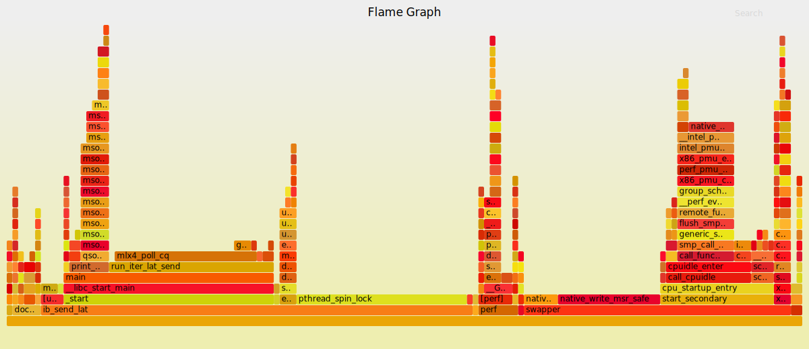

图为关闭 ffrouter 后，在主机 Verbs 上运行 ib_send_lat 产生的火焰图。Perf 在当前系统中捕捉到的任务有：

- docker-containe???
- dockerd
- **ib_send_lat**
- irq/116-nvidia
- perf
- rcu_sched
- swapper
- weaver

```bash
perf record -F 99 -a --call-graph dwarf -- ib_send_lat -n 10000000 192.168.10.141
```

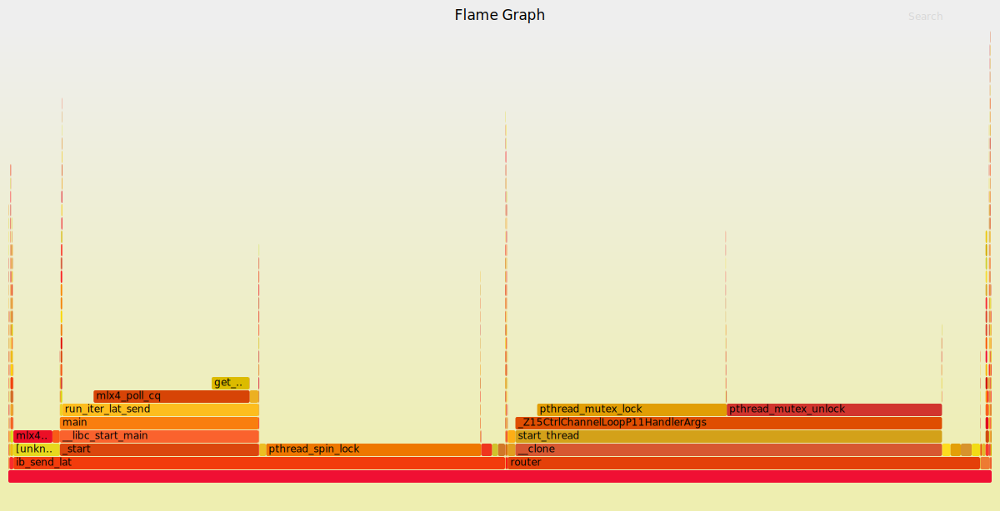

图为开启 ffrouter 后，在主机 Verbs 上运行 ib_send_lat 产生的火焰图。此时，perf 捕捉到的任务主要为 ib_send_lat 和 router，其它可忽略不计。

```bash
perf record -F 99 -a --call-graph dwarf -- \
	docker exec -it node1 ib_send_lat -n 10000000 10.44.0.0
```

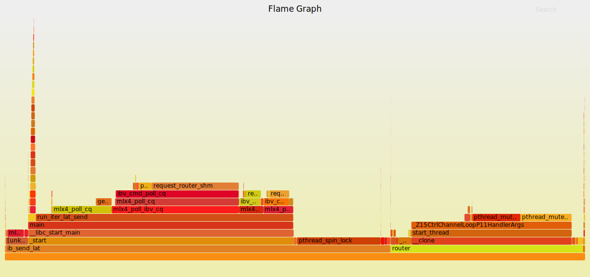

图为 ffrouter 运行在 fastpath 模式下，在 FreeFlow Verbs 上运行 ib_send_lat 产生的火焰图。此时，ib_send_lat 中引入了额外的控制开销，即 ibv_cmd_* (29.4%)，占 run_iter_lat_send (45%) 的 65.3%。

```bash
perf record -F 99 -a --call-graph dwarf -- \
	docker exec -it node1 bash -c "DISABLE_FASTPATH=1 ib_send_lat -n 100000 10.44.0.0"
```

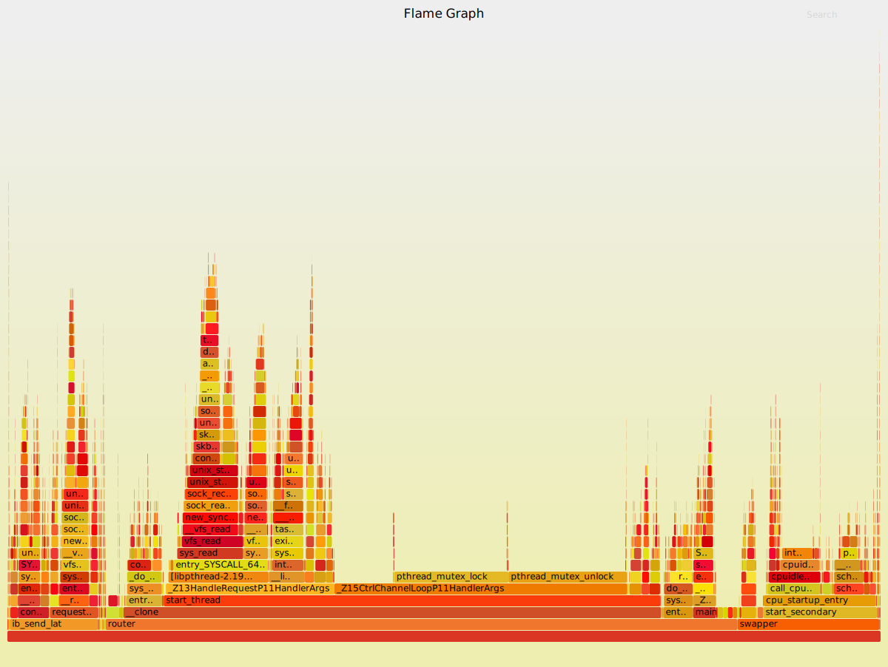

图为 ffrouter 运行在 low CPU 模式下，在 FreeFlow Verbs 上运行 ib_send_lat 产生的火焰图。此时，所有的控制信息都走 Unix Socket，最后由 RequestHandler 处理。其中，ib_send_lat 中超过 90% 的开销都是 Unix Socket 的开销。Router 中 26.7% 的开销为 Unix Socket 的通信。

**Q3.** 相比主机 Verbs，FreeFlow Verbs 为什么有严重的**尾延迟**？

延迟测试的命令如下：

```bash
ib_send_lat -U -n 10e7 192.168.10.141
```

即 ib_send_lat 产生 1e7 次 SEND 请求并给出所有请求的延迟。下面给出一次测试中所有 SEND 请求延迟随着时间的变化情况。目前测了三种情况：

1. ib_send_lat over 主机 Verbs
2. ib_send_lat over FreeFlow Verbs
3. ib_send_lat over FreeFlow Verbs with low CPU usage

其中，第一张图为情况 1、2 的合并，其它依次对应。

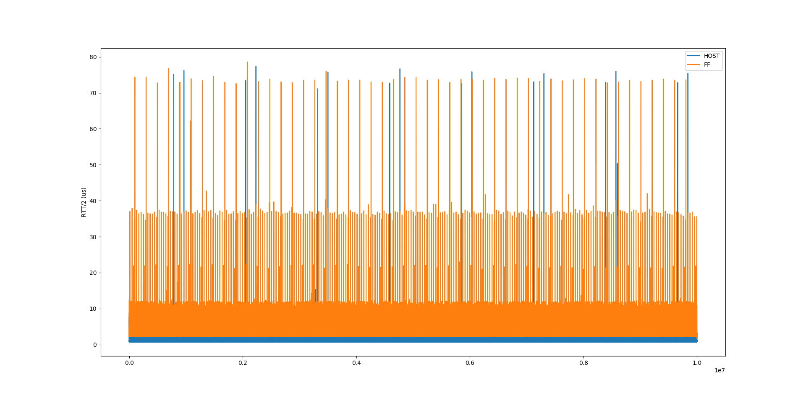

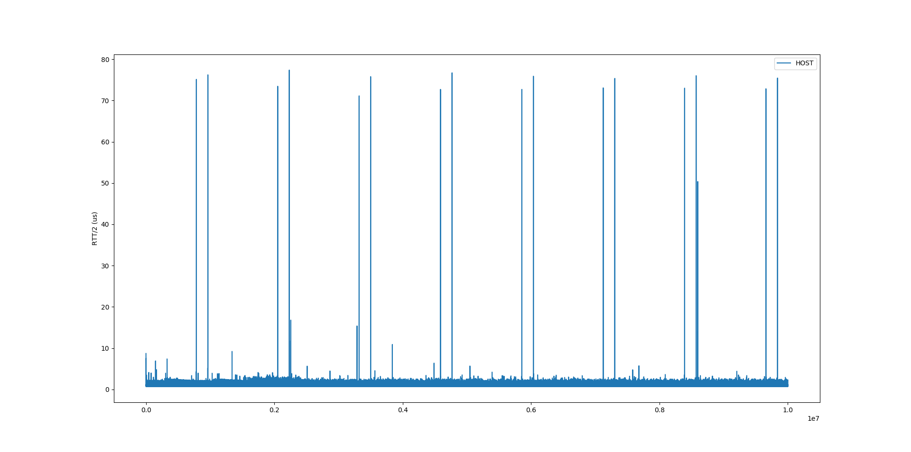

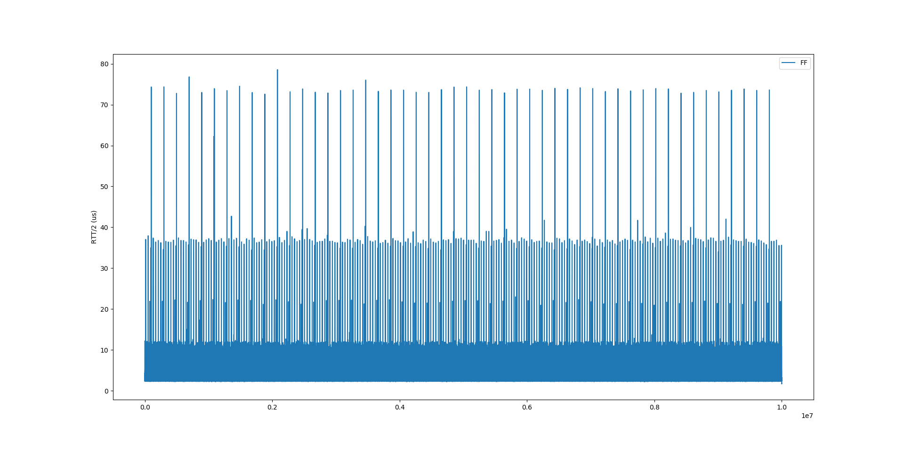

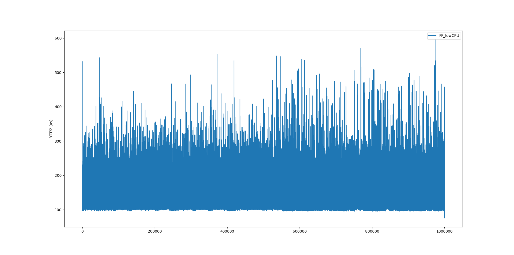

由图可得，1e7 次 SEND 延迟中，延迟较高的情况是周期性出现的，考虑和 ib_send_lat 的实现有关，所以这里先通过阅读源码给出 ib_send_lat 的流程。

ib_send_lat 默认使用一个 WR，中间包含一个 segment，所传数据大小默认为 2 字节。如果 message size 小于 MAX_INLINE（912 字节），则使用 inline 模式（默认情况下，使用 RNIC 发送一个 message 需要在 RNIC 和主存之间传输两次，一次为读取 WR 到 RNIC，第二次是读取 message 到 NIC）。Inline 模式下，可以将 WR 和 message 一起读到 RNIC。给出关键代码的简化版：

```c
/* Note: only x86 CPUs which have rdtsc instruction are supported. */
typedef unsigned long long cycles_t;
static inline cycles_t get_cycles() {
    unsigned low, high;
    unsigned long long val;
    asm volatile("rdtsc" : "=a"(low), "=d"(high));
    val = high;
    val = (val << 32) | low;
    return val;
}

int run_iter_lat_send(struct pingpong_context *ctx,
                      struct perftest_parameters *user_param) {
    uint64_t scnt = 0; /* sent packets counter */
    uint64_t rcnt = 0; /* received packets counter */
    int poll = 0;
    int ne;
    int err = 0;
    struct ibv_wc wc;
    struct ibv_recv_wr *bad_wr_recv;
    struct ibv_send_wr *bad_wr;

    int size_per_qp = user_param->rx_depth;
    cycles_t end_cycle, start_gap = 0;

    ctx->wr[0].sg_list->length = user_param->size;
    ctx->wr[0].send_flags = 0;
    ctx->wr[0].send_flags |= IBV_SEND_INLINE;

    struct rusage rusage;
    getrusage(RUSAGE_SELF, &rusage);
    fprintf(stderr, "page reclaims => %ld\n v cs => %ld iv cs => %ld\n",
            rusage.ru_minflt, rusage.ru_nvcsw, rusage.ru_nivcsw);

    while (scnt < user_param->iters || rcnt < user_param->iters)

        // \begin to poll to handle a rwr
        /*
         * Get the received packet. make sure that the client won't enter here
         * until he sends his first packet (scnt < 1) server will enter here
         * first and wait for a packet to arrive (from the client)
         */
        if (rcnt < user_param->iters &&
            !(scnt < 1 && user_param->machine == CLIENT)) {
            do {
                ne = ibv_poll_cq(ctx->recv_cq, 1, &wc);

                if (ne > 0) {
                    if (wc.status != IBV_WC_SUCCESS) {
                        NOTIFY_COMP_ERROR_RECV(wc, rcnt);
                        return 1;
                    }

                    rcnt++;

                    if (rcnt + size_per_qp <= user_param->iters) {
                        if (ibv_post_recv(ctx->qp[0], &ctx->rwr[0],
                                          &bad_wr_recv)) {
                            fprintf(stderr, "Couldn't post recv: rcnt=%lu\n",
                                    rcnt);
                            return 15;
                        }
                    }
                } else if (ne < 0) {
                    fprintf(stderr, "poll CQ failed %d\n", ne);
                    return 1;
                }
            } while (ne == 0);
        }
    // \end to poll to handle a rwr

    // \begin to post a swr
    if (scnt < user_param->iters) {

        if (user_param->test_type == ITERATIONS)
            // typedef unsigned long long cycles_t;
            // ALLOCATE(user_param->tposted, cycles_t, tarr_size);
            user_param->tposted[scnt] = get_cycles();

        scnt++;

        if (scnt % user_param->cq_mod == 0 ||
            (user_param->test_type == ITERATIONS &&
             scnt == user_param->iters)) {
            poll = 1;
            ctx->wr[0].send_flags |= IBV_SEND_SIGNALED;
        }

        /* send the packet that's in index 0 on the buffer */
        err = ibv_post_send(ctx->qp[0], &ctx->wr[0], &bad_wr);

        if (poll == 1) {
            struct ibv_wc s_wc;
            int s_ne;

            /* wait until you get a cq for the last packet */
            do {
                s_ne = ibv_poll_cq(ctx->send_cq, 1, &s_wc);
            } while (s_ne == 0);

            if (s_ne < 0) {
                fprintf(stderr, "poll on Send CQ failed %d\n", s_ne);
                return FAILURE;
            }

            if (s_wc.status != IBV_WC_SUCCESS) {
                NOTIFY_COMP_ERROR_SEND(s_wc, scnt, scnt)
                return 1;
            }
            poll = 0;

            ctx->wr[0].send_flags &= ~IBV_SEND_SIGNALED;
        }
    }
    // \end to post a swr

    getrusage(RUSAGE_SELF, &rusage);
    fprintf(stderr, "page reclaims => %ld\n v cs => %ld iv cs => %ld\n",
            rusage.ru_minflt, rusage.ru_nvcsw, rusage.ru_nivcsw);

    // @print_report_lat
    // for (i = 0; i < measure_cnt; ++i) {
    //     delta[i] = user_param->tposted[i + 1] - user_param->tposted[i];
    // }

    return 0;
}
```

程序执行以下逻辑 n 次：

1. Poll 一个 WC 以接收 2 字节数据，然后 rcnt++；
2. 统计一个时间 t[scnt] 并 scnt++，然后 post 一个 SWR 并 poll 其 WC 以发送两字节的数据。

最后两次 SEND 时间差的一半为 SEND 的延迟。在主循环的前后加入探针（输出当前进行的缺页中断次数 / 强制上下文次数）发现当出现较高延迟时往往伴随着强制上下文切换。

TODO：仍未明确原因

### Refs

- Performance Tests README for OFED 3.0. https://github.com/linux-rdma/perftest.
- iperf3: A TCP, UDP, and SCTP network bandwidth measurement tool. https://github.com/esnet/iperf.
- A VMA Basic Sockperf test Examples. https://github.com/Mellanox/libvma/wiki/A-VMA-Basic-Sockperf-test-Examples.
- Implementing TCP Sockets over RDMA. https://www.openfabrics.org/images/eventpresos/workshops2014/IBUG/presos/Thursday/PDF/09_Sockets-over-rdma.pdf.
- Sockets vs RDMA Interface over 10-Gigabit Networks: An In-depth analysis of the Memory Traffic Bottleneck. http://nowlab.cse.ohio-state.edu/static/media/publications/abstract/balaji-rait04-10gige.pdf.


## Real-world applications

TODO

- Memcached or Redis
- PostgreSQL / Nginx / Kafka

### Refs

- *Slim: OS Kernel Support for a Low-Overhead Container Overlay Network. NSDI '19*. https://www.usenix.org/presentation/zhuo.

## Appendix

### 服务器优化

- 查看 Cache 大小和布局

```bash
$ hwloc-ls
$ lscpu | grep cache
L1d cache:             32K
L1i cache:             32K
L2 cache:              256K
L3 cache:              25600K
```

- 查看 CPU 理论速度

```bash
$ dmidecode -t processor | grep Speed
	Max Speed: 4000 MHz
	Current Speed: 2300 MHz
```

- 查看 CPU 实时速度

```bash
$ cat /proc/cpuinfo | grep MHz
cpu MHz		: 1199.953
$ cpufreq-info -mf
1.79 GHz
```

- Maximize CPU frequency。其中，cpufreq 为内核驱动。

```bash
for t in /sys/devices/system/cpu/cpu*/cpufreq/scaling_governor; do
	echo -n "performance" > $
done
```

- BIOS 里面关闭超线程

Refs:

- Any way to check the clock speed of my processor? https://askubuntu.com/questions/218567/any-way-to-check-the-clock-speed-of-my-processor.
- How I can disable CPU frequency scaling and set the system to performance? https://askubuntu.com/questions/523640/how-i-can-disable-cpu-frequency-scaling-and-set-the-system-to-performance.

### Understanding RDMA


Refs:

- Infiniband 概念空间分析. https://zhuanlan.zhihu.com/p/50789624.

### ftrace 工具使用

ftrace 为 Linux 内核模块，通过 debugfs 对外提供接口，所以不需要额外的工具进行支持。debugfs 在大部分发行版中都 mount 在 /sys/kernel/debug 目录下，而 ftrace 就在这个目录的 tracing 目录中。

一些常用的操作：

```bash
cd /sys/kernel/debug/tracing/

## INSTANCE
# 查看缓冲区大小
cat buffer_size_kb
cat buffer_total_size_kb
# 读取缓冲区中的数据，trace_pipe 是个 pipe，可以用于动态读
cat trace
cat trace_pipe | stream_handler
# trace 等文件的输出是综合所有 CPU 的，若关心单个 CPU 则进入 per_cpu 目录
cd per_cpu/cpu*/
# 向 trace 文件写一个空字符可以清空对应的缓冲区
echo > trace
# 向 tracing_on 写 1 启动跟踪，写 0 停止跟踪
echo [0|1] > tracing_on
# 向 set_ftrace_pid 写 PID 可以限制只跟踪某个 PID 的事件等
echo $PID > set_ftrace_pid
# 开启某个功能就 echo 某个字符串进去，关闭就 echo 一个加了 no 前缀的字符串
echo [no]options > trace_options
echo $MASK > tracing_cpumask

## EVENT
# 查看哪些可用的事件
cat available_events 
# 把相关事件写进 set_event
echo -e "sched:*" > set_event
# 添加 filter 用于跟踪调度器切换到 cs 这个线程的场景
echo 'next_comm ~ "cs"' > events/sched/sched_switch/filter

## 预定义功能
# 查看内核支持的跟踪功能
cat available_tracers
# enable 跟踪系统唤醒的时延
echo wakeup > current_tracer
# disable 跟踪系统唤醒的时延
echo nowakeup > current_tracer

## 函数跟踪

## 用户态跟踪

## 会话跟踪

```

Refs:

- 在 Linux 下做性能分析 2：ftrace. https://zhuanlan.zhihu.com/p/22130013.

### perf 工具使用

perf 的原理是这样：每隔一个固定的时间，就在 CPU 上（每个核上都有）产生一个中断，在中断上看看，当前是哪个 pid，哪个函数，然后给对应的 pid 和函数加上一个统计值，这样，我们就知道 CPU 在百分几的时间在某个 PID，或者某个函数上了。这个原理图示如下：


很明显可以看出，这是一种采样的模式，我们预期，运行时间越多的函数，被时钟中断击中的机会越大，从而推测，那个函数（或者 PID 等）的 CPU 产用率就越高。

一些常用的操作：

```bash
# 列出 perf 可以支持的所有事件，包括 tracepoint@ltrace
perf list
# -e 指定跟踪的事件，多个实践同时跟踪则用逗号隔开（但显示的时候会分开显示）
perf top -e branch-misses,cycles
# 事件可以指定后缀，比如我想只跟踪发生在用户态时产生的分支预测失败
perf top -e branch-misses:u,cycles
# 全部时间都有这个要求，我还可以
perf top -e '{branch-misses:u,cycles}'
# -s 指定按某参数进行分类，多个域用逗号隔开
perf top -e 'cycles' -s comm,pid,dso # command, pid, shared object
# 启动一次跟踪（perf-record 会在当前目录产生一个 perf.data 文件，用来记录过程数据）。-a 可以让 
# perf-record 跟踪整个系统的性能，否则仅仅跟踪发生在特定 PID 的事件。-c 可以指定事件的触发次数。
# -g 开启堆栈跟踪。
perf record -g -a -e 'cycles' -- myapplication arg1 arg2
# 使用 dwarf 进行堆栈跟踪
perf record --call-graph dwarf -- myapplication arg1 arg2
# 输出跟踪的结果
perf report -n --stdio --no-children
# 统计
perf stat
# perf.data 只包含原始数据，perf report 需要访问本地的符号表、PID 和进程的对应关系等信息来生成报告。
# 所以 perf.data 不能直接拷贝到其他机器上使用。但可以通过 perf-archive 命令把所有这些数据打包，这样
# 移到另一个机器上就可以用了，当然 perf-archive 备份的代码不能跨平台使用（比如你从 arm 平台上备份的数# 据，在 x86 上是分析不了的）。
perf-archive perf.data
# perf.data 保留前一个版本，可以支持 perf diff 这个命令，这个命令比较两次运行的区别
perf diff perf.data.old perf.data # perf.data.old as baseline and perf.data as delta
```

Refs: 

- perf Examples. http://www.brendangregg.com/perf.html.
- 在 Linux 下做性能分析 3：perf. https://zhuanlan.zhihu.com/p/22194920.

### Debug symbols

一些常用的操作

```bash
# 检查 symtab 是否可用
objdump --syms binary
# 检查是否存在 debug section，即是否存在 debug info
readelf -S | grep debug
# 在 binary 中插入调试信息，
gcc -g $^ -o $@
# GCC 优化默认抛弃 frame pointer，以下 flag 禁止次操作
gcc -fno-omit-frame-pointer $^ -o $@
# 当然 dwarf 中的 CFI 可以用于生成 call-graph。参见 perf record --help
# `perf record --call-graph` allows specifying "fp" (frame pointer) or "dwarf"
# (DWARF's CFI - Call Frame Information) or "lbr" (Hardware Last Branch Record 
# facility) as the method to collect the information used to show the call graphs.
# 
# In some systems, where binaries are build with gcc --fomit-frame-pointer, using 
# the "fp" method will produce bogus call graphs, using "dwarf", if available 
# (perf tools linked to the libunwind or libdw library) should be used instead.
# Using the "lbr" method doesn't require any compiler options. It will produce 
# call graphs from the hardware LBR registers. The main limitation is that it 
# is only available on new Intel platforms, such as Haswell. It can only get 
# user call chain. It doesn't work with branch stack sampling at the same time.
#
# When "dwarf" recording is used, perf also records (user) stack dump when sampled.  
# Default size of the stack dump is 8192 (bytes). User can change the size by 
# passing the size after comma like "--call-graph dwarf,4096".

# Ubuntu 上，库有专用的 debug symbol 包，其路径在 /usr/lib/*
# 1. 添加 repo
# 2. Import the debug symbol archive signing key
sudo apt-key adv --keyserver keyserver.ubuntu.com \
--recv-keys F2EDC64DC5AEE1F6B9C621F0C8CAB6595FDFF622
# 3. Then update
sudo apt update
# 4. Install debug packages for libc
sudo apt install libc6-dbg
```

Refs:

- Debug Symbol Packages. https://wiki.ubuntu.com/Debug%20Symbol%20Packages.
- How can I get perf to find symbols in my program. https://stackoverflow.com/questions/10933408/how-can-i-get-perf-to-find-symbols-in-my-program.

### Tools to profile networking performance

